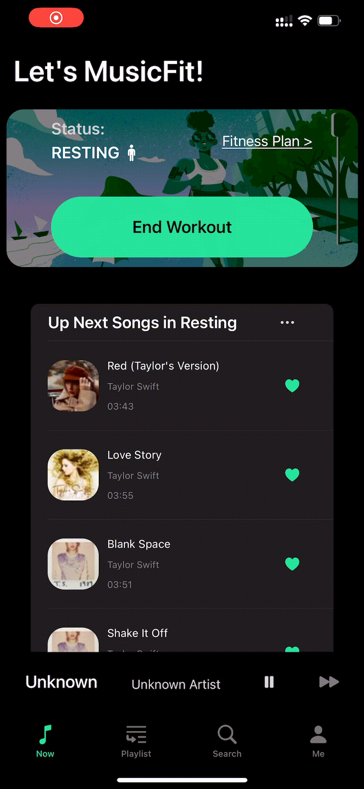
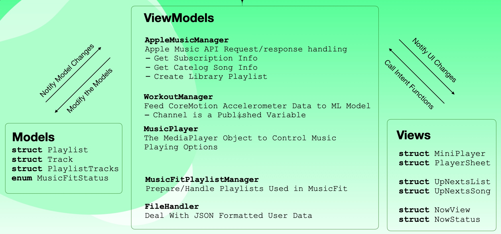

# MusicFit
## Intro
This app is a re-discovery of users' music listening experience and their physical behavioral changes when users are doing workouts. The app can let the user set up different playlists for three different statuses (running, walking, or just resting). Later when the user clicks the *Start Workout* button on the main page, the app can recognize (using a pre-trained machine learning model) one of three statuses and push different playlists for the user to listen to accordingly.

## Screenshots

## App Dev Overal Structure
Basically, this app uses a SwiftUI MVVM architecture to separate models of playlist, music etc., views like each interface and view models of Apple Music API implementations, workout manager session. The nature of auto-update feature of @ObservedObject and @ObservableObject in SwiftUI makes it easy to implement the "context-aware" part of this app: when the workout manager detects user status change, notification will be pushed to make playlist model update accordingly, and the view of the mini player and the player is changed also.

## User Evaluation
### Experimental group
1、Stand still, the phone shows the rest state
2、Start running, record the time needed to switch to running state T1 after starting to run
3、Run for 1min, then stop and walk for 30s, record the time needed to switch to rest state T2
4、then stop to rest, record the time required to switch to the rest state T3
5、Record the number of times the user needs to unlock the phone screen n1 and the number of steps the user takes to operate the phone n2 (each tap on the screen is counted as one step) 🌟

### Control group
1、Stand Still, the phone shows rest state
2、Switch the running song list, start running, record the time needed to switch the song list T1'
3、Run for 1min, then stop walking and switch to the walking song list, record the time needed to switch to the walking song list T2'
4、Stop and rest, record the time required to switch to the rest song list T3'
5、Record the number of times the user needs to unlock the phone screen n1' and the number of steps the user takes to operate the phone n2' (each tap on the screen is counted as one step) 🌟